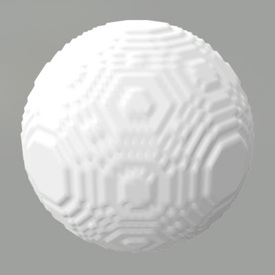
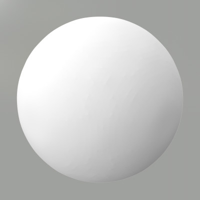

# PyMCubes

`PyMCubes` is an implementation of the marching cubes algorithm to extract
iso-surfaces from volumetric data. The volumetric data can be given as a
three-dimensional `NumPy` array or as a Python function ``f(x, y, z)``.

`PyMCubes` also provides functions to export the results of the marching cubes
in a number of mesh file formats.

## Installation

Use `pip`:
```
$ pip install --upgrade PyMCubes
```

## Example

The following example creates a `NumPy` volume with spherical iso-surfaces and
extracts one of them (i.e., a sphere) with `mcubes.marching_cubes`. The result
is exported to `sphere.dae`:

```Python
  >>> import numpy as np
  >>> import mcubes

  # Create a data volume (30 x 30 x 30)
  >>> X, Y, Z = np.mgrid[:30, :30, :30]
  >>> u = (X-15)**2 + (Y-15)**2 + (Z-15)**2 - 8**2

  # Extract the 0-isosurface
  >>> vertices, triangles = mcubes.marching_cubes(u, 0)

  # Export the result to sphere.dae
  >>> mcubes.export_mesh(vertices, triangles, "sphere.dae", "MySphere")
```

Alternatively, you can use a Python function to represent the volume instead of
a `NumPy` array:

```Python
  >>> import numpy as np
  >>> import mcubes

  # Create the volume
  >>> f = lambda x, y, z: x**2 + y**2 + z**2

  # Extract the 16-isosurface
  >>> vertices, triangles = mcubes.marching_cubes_func((-10,-10,-10), (10,10,10),
  ... 100, 100, 100, f, 16)

  # Export the result to sphere.dae (requires PyCollada)
  >>> mcubes.export_mesh(vertices, triangles, "sphere.dae", "MySphere")

  # Or export to an OBJ file
  >>> mcubes.export_obj(vertices, triangles, 'sphere.obj')
```

Note that using a function to represent the volumetric data is **much** slower
than using a `NumPy` array.

## Smoothing binary arrays


Many segmentation methods build binary masks to separate _inside_ and _outside_
areas of the segmented object. When passing these binary mask to the marching
cubes algorithm the resulting mesh looks jagged. The following code shows an
example with a binary array embedding a sphere.
```Python
x, y, z = np.mgrid[:100, :100, :100]
binary_sphere = (x - 50)**2 + (y - 50)**2 + (z - 50)**2 - 25**2 < 0

# Extract the 0.5-levelset since the array is binary
vertices, triangles = mcubes.marching_cubes(binary_sphere, 0.5)
```


`PyMCubes` provides the function `mcubes.smooth` that takes a 2D or 3D binary
embedding function and produces a smooth version of it.
```Python
smoothed_sphere = mcubes.smooth(binary_sphere)

# Extract the 0-levelset (the 0-levelset of the output of mcubes.smooth is the
# smoothed version of the 0.5-levelset of the binary array).
vertices, triangles = mcubes.marching_cubes(smoothed_sphere, 0)
```


`mcubes.smooth` builds a smooth embedding array with negative values in the
areas where the binary embedding array is 0, and positive values in the areas
where it is 1. In this way, `mcubes.smooth` keeps all the information from the
original embedding function, including fine details and thin structures that
are commonly eroded by other standard smoothing methods.
